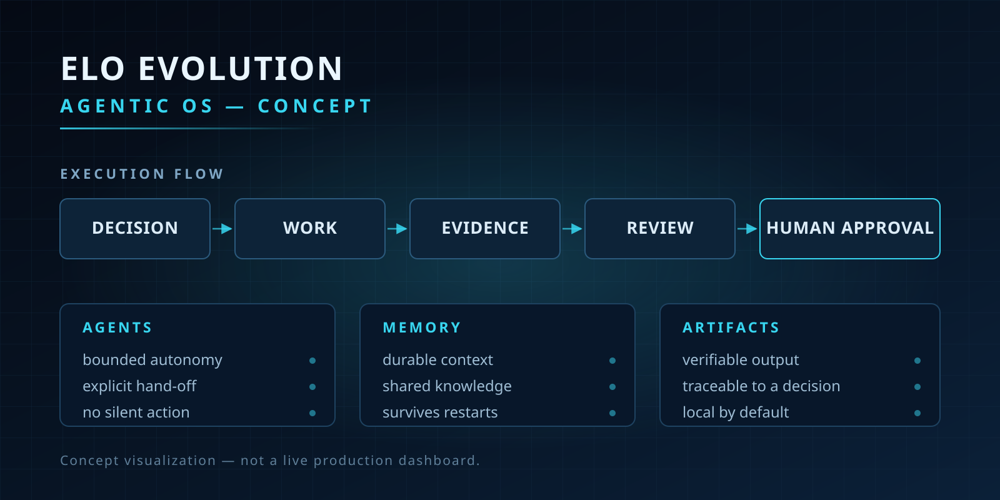

<!--
  Repo `ghostON3/ghostON3` — GitHub renders this on the profile page.
  Every image and link below is committed here or points at a public repo,
  so everything resolves for anyone. No private links.
-->

# Michal Duchoň

**Building local-first AI agents, orchestration systems, and privacy-first
automation.**

I work on how agent teams can preserve context, coordinate real work, produce
verifiable artifacts, and stay under meaningful human control. Polyglot —
TypeScript, Rust, Python, SQL, Bash. Local-first by default.

My working definition of done: a capability proven end-to-end and actually
consumed by something. Not `tsc`-green, not a passing build with no user.

> Concept visualization — not a live production dashboard.

## Start here

| Project | Language | What it is |
|---|---|---|
| [**social-toolkit**](https://github.com/ghostON3/social-toolkit) | Python | Read, understand and publish social content. DM harvesting into a structured corpus + a 12-platform posting facade. **91 tests, CI green.** |
| [**eslint-plugin-ghost**](https://github.com/ghostON3/eslint-plugin-ghost) | TypeScript | 11 architecture-enforcing lint rules that fail the build on boundary violations. **94 tests green.** |
| [**elo-time-tracker**](https://github.com/ghostON3/elo-time-tracker) | Rust | Per-application focus-time daemon: Hyprland IPC → SQLite, shipped as a systemd unit. |
| [**elo-evolution-showcase**](https://github.com/ghostON3/elo-evolution-showcase) | TypeScript | Event sourcing with a hash-chained log and tamper detection — the core of the agent platform, extracted to be readable. |
| [**snap-extract**](https://github.com/ghostON3/snap-extract) | Shell | Screenshot a file tree, get its contents in your clipboard. Local OCR, no cloud. |
| [**dopamine-git**](https://github.com/ghostON3/dopamine-git) | Shell | A git PATH shim that speaks the repo and branch aloud — catches every agent, script and teammate, because it listens to git rather than to any one tool. |

Every one is public and runs from a clean clone.

## Selected work

### Orchestrating a fleet of coding agents

Queues, leases, heartbeats, hash-chained event logs, and lint rules that fail
the build. The interesting problem is not calling a model — it is the machinery
that keeps a fleet of agents honest without a human acting as the router.

Runnable pieces of it: [`elo-agent-slots`](https://github.com/ghostON3/elo-agent-slots)
(agents discover their own work from slots) and
[`elo-evolution-showcase`](https://github.com/ghostON3/elo-evolution-showcase).

### Local-first AI, in the browser

A Manifest V3 extension that captures conversations across AI services and
answers from a **local Ollama model — prompts never leave the machine.** When a
capability belongs in the browser, the editor or the OS, I ship it there rather
than forcing it into a web app.

### Motion quality as an engineering question

An animation lab that samples a curve into velocity, acceleration and jerk and
grades it against the minimum-jerk model (Flash & Hogan, 1985) — the trajectory
natural human movement follows. "Does it feel right" becomes measurable instead
of a matter of taste.

## How I work

- Keep private data local by default
- Require evidence for consequential automation
- Preserve human control over external actions
- Build independently useful, composable components
- Write decisions down: [`assets/vault-map.txt`](assets/vault-map.txt) is a map
  of the 3,265-note vault the work is planned in

---

Open to senior / staff roles where the bar is real systems work across the
stack. The fastest way to read me is the code — start with
[`social-toolkit`](https://github.com/ghostON3/social-toolkit) or
[`eslint-plugin-ghost`](https://github.com/ghostON3/eslint-plugin-ghost).
