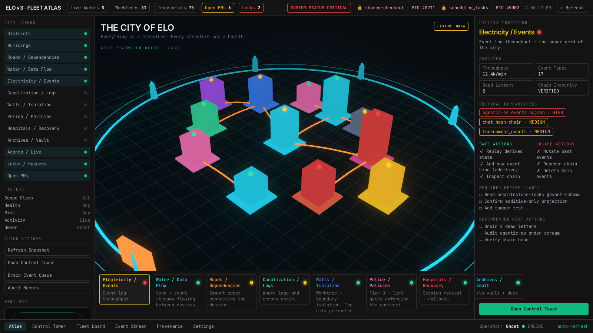
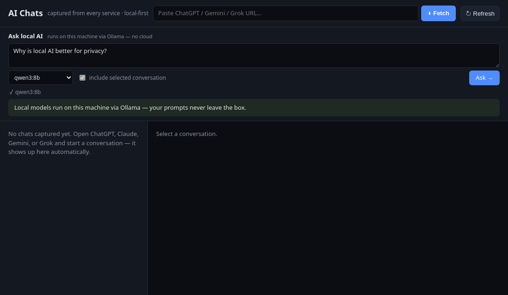
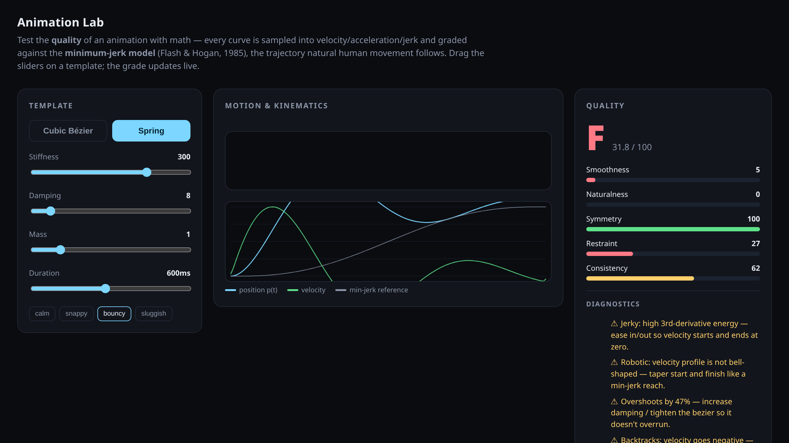

<!--
  Repo `ghostON3/ghostON3` — GitHub renders this on the profile page.
  Every image/link below is committed in this public repo or points at a
  public repo, so it resolves for anyone. No private links, no vibe.
-->

# Michal — `ghostON3`

> I am god in my repository.

Not a slogan — an operating model. I don't just write code; I run a small
**world**: a 3,000-note knowledge vault, an autonomous fleet of AI agents that
ship against my own monorepo, and products that reach across web, desktop,
mobile, TV and the browser. The frame below has **five angles**. Every one
resolves to something you can open and inspect — a live repo, a committed
screenshot, a real count. Proof, not adjectives.

Polyglot (TypeScript · Rust · Python · SQL · Bash), local-first, sovereign by
default. Done = a capability proven end-to-end and live — never `tsc`-green
theatre.

---

### 1 · The vault — the substrate I think on

[`assets/vault-map.txt`](assets/vault-map.txt) — **3,265 markdown notes** across
ten domains (meta, projects, research, infra, journal, archive…), an Obsidian
graph I've kept for years.

*Why it matters:* every decision, spec and post-mortem is written down and
queryable — and the agent fleet reads from it. The knowledge isn't in my head
where it dies; it's a substrate the machines operate on.

### 2 · The agentic OS — the world I operate

Public proof you can run: [`elo-agent-slots`](https://github.com/ghostON3/elo-agent-slots)
(agents discover their own work from slots) and
[`elo-evolution-showcase`](https://github.com/ghostON3/elo-evolution-showcase)
— **2,200+ PRs shipped by an autonomous agent dark factory**.

*Why it matters:* queue, leases, heartbeats, hash-chained event logs and lint
rules that fail the build. I'm the conductor, not the runtime — the hard part is
the machine that keeps a fleet of agents honest without a human as the router.

### 3 · Extensions — reach into every surface

A Manifest-V3 browser extension that captures conversations from every AI
service and lets you **ask a local Ollama model — prompts never leave the box**.

*Why it matters:* I don't stop at the web app. When a capability needs to live
in the browser, the editor, the desktop or the OS, I ship it there — local-first,
no cloud middleman.

### 4 · Music & dopamine experiments — I tune the feel, not just the function

Spring/jerk-minimized motion profiles from my animation lab, paired with an
audio-domain track (music-frequency profiling, attention fragmentation, prosody)
— prototyping reward and attention, measured, not guessed.

*Why it matters:* senior work isn't only correctness. I instrument the dopamine
loop — how motion and sound land on a human — and treat "does it feel right" as
an engineering question with a proof.

### 5 · Public repos — inspectable craft

| Repo | Language | Proof |
|------|----------|-------|
| [eslint-plugin-ghost](https://github.com/ghostON3/eslint-plugin-ghost) | TypeScript | 11 architecture-enforcing rules · **94 tests green** |
| [elo-time-tracker](https://github.com/ghostON3/elo-time-tracker) | Rust | Hyprland IPC → SQLite daemon · **cargo release + 16 tests green** |
| [elo-evolution-showcase](https://github.com/ghostON3/elo-evolution-showcase) | TypeScript | event sourcing + hash-chain tamper detection · 4 tests green |
| [ghost-dotfiles](https://github.com/ghostON3/ghost-dotfiles) | Shell/Hypr | Arch + Hyprland workstation as code |

*Why it matters:* every link is open, every repo builds and tests green from a
clean clone. The fastest way to read me is the code, not this page.

---

Open to senior / staff roles where the bar is real systems work across the
stack. Start with [`eslint-plugin-ghost`](https://github.com/ghostON3/eslint-plugin-ghost).
