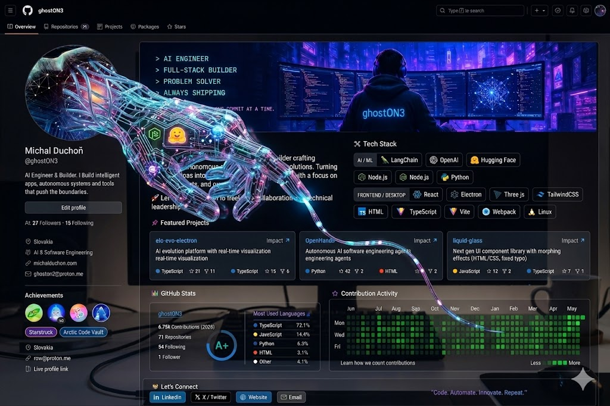

<!--
  GitHub profile README for @ghostON3
  This file MUST live in a repo named exactly  ghostON3/ghostON3  to render on your profile.
  See SETUP.md for the 4 commands to publish it.
-->

<!-- ░░░ HERO BANNER ░░░ -->
<!-- Replace with a wide assets/banner.png render later if desired. -->

  

<h1 align="center">Michal Duchoň</h1>

<b>AI Engineer &amp; Builder</b> — I build intelligent apps, autonomous systems and tools that push the boundaries.

  <code>&gt; AI ENGINEER</code> &nbsp;•&nbsp;
  <code>&gt; FULL-STACK BUILDER</code> &nbsp;•&nbsp;
  <code>&gt; PROBLEM SOLVER</code> &nbsp;•&nbsp;
  <code>&gt; ALWAYS SHIPPING</code>

  
  

---

## 🛠 Tech Stack

#### AI / ML

#### Backend

#### Frontend / Desktop

#### Language / Build

---

## 🚀 Featured Projects

<table>
  <tr>
    <td width="33%" valign="top">
      
      
AI evolution platform with real-time visualization.

    </td>
    <td width="33%" valign="top">
      
      
Autonomous AI software-engineering agents.

    </td>
    <td width="33%" valign="top">
      
      
Next-gen UI component library with morphing effects.

    </td>
  </tr>
</table>

---

## 📊 GitHub Stats

  
  

  

### 🟩 Contribution Activity

  <!-- Auto-generated by the snake action (see SETUP.md). Falls back to the activity graph below. -->
  

---

## 🤝 Let's Connect

  
  
  
  

<i>"Code. Automate. Innovate. Repeat."</i>

